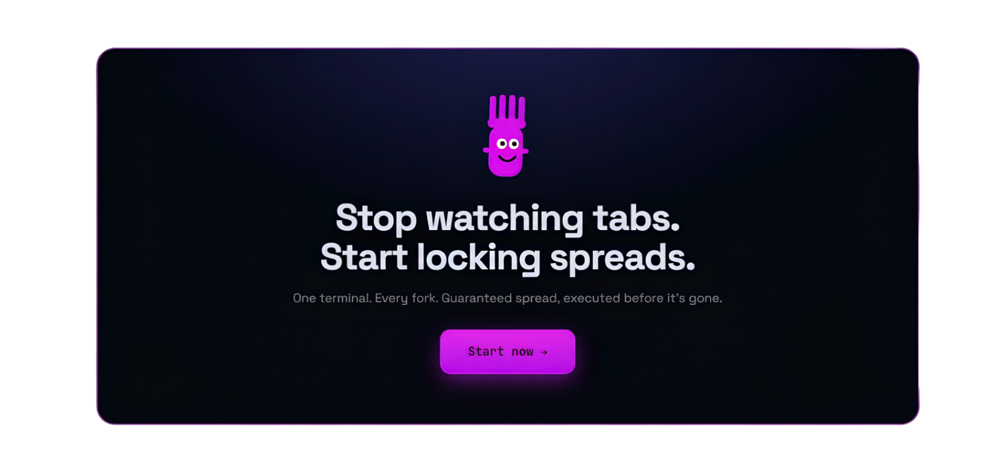
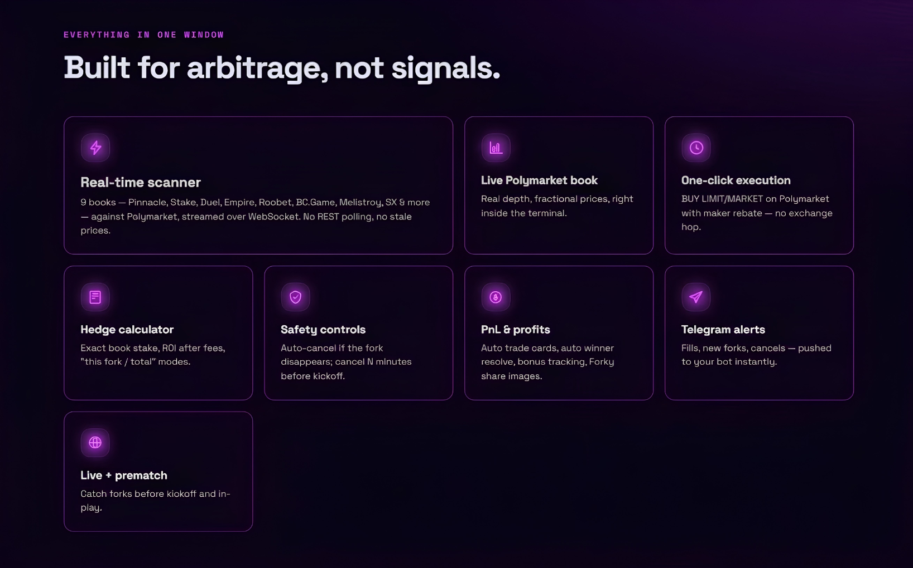
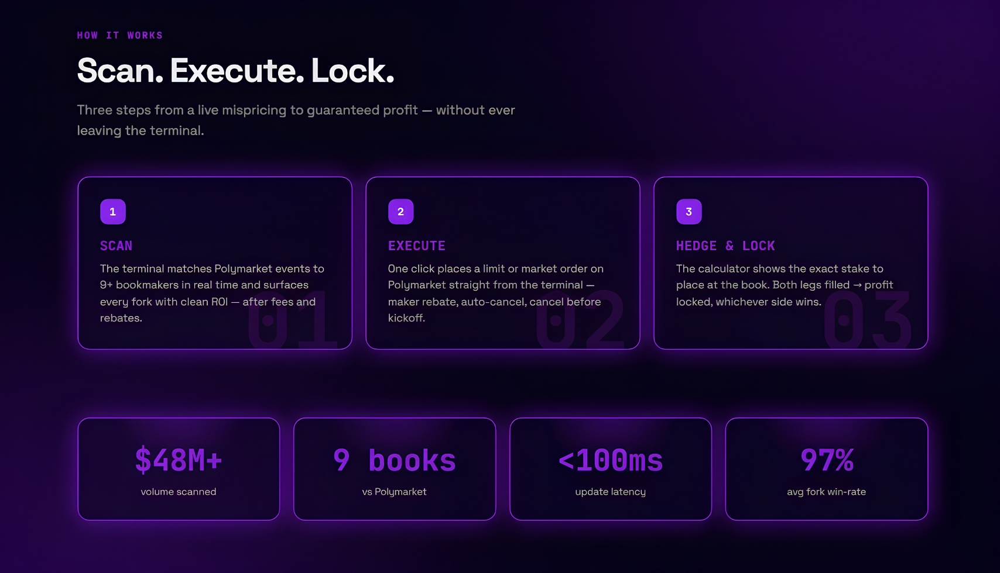
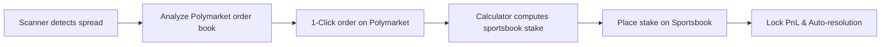

# HTMM-PM — Next-Gen Polymarket & Sportsbook Arbitrage Terminal

**HTMM-PM** is a desktop trading terminal and automation ecosystem designed for cross-platform sports and political arbitrage ("surebets") between the decentralized prediction platform **Polymarket** (Polygon, USDC) and traditional / crypto sportsbooks.

  

---

## 🚀 Why Choose HTMM-PM?

**Unlike standard web scanners and manual spreadsheets, HTMM-PM is built from the ground up as a high-frequency trading (HFT) tool for arbitrage professionals.**

### Features:

* ⚡ **Ultra-Low Latency (<25 ms):** Direct WebSocket streaming to Polymarket CLOB API and sportsbooks instead of slow REST polling. Spot spreads before 95% of the market.
* 🛡️ **100% Non-Custodial Security:** The terminal never holds your funds or main private keys. Interactions with Polymarket use scoped session keys without withdrawal permissions.
* 🎯 **Direct One-Click Execution:** Place orders on Polymarket straight from the terminal interface without switching browser tabs or managing multiple windows.
* 🧮 **Maker Rebate & Fee Accounting:** Automated net ROI calculation factoring in Polymarket liquidity provider payouts (Maker Rebates) and hidden bookmaker juice/fees.
* 🔒 **Unhedged Leg Protection:** Automatically cancels unfulfilled limit orders if bookmaker odds shift unfavorably.
* 💻 **Native Desktop GUI:** Autonomous, lightweight client for Windows and macOS supporting background operation and Telegram bot synchronization.
* 📊 **Automated PnL Engine:** Complete trade journaling with auto-resolving event outcomes, CSV/Excel exports, and shareable performance cards.

---

## 🛠️ Desktop Client Installation

The HTMM-PM desktop client is distributed as standalone installation packages for **Windows** (`.exe`) and **macOS** (`.dmg`).

### System Requirements:

* **OS:** Windows 10/11 (64-bit) or macOS 12.0+ (Apple Silicon M1/M2/M3 or Intel).
* **Network:** Stable internet connection (recommended ping to AWS/Polygon nodes <50 ms).
* **RAM:** Minimum 4 GB.

---

### 1. Windows Installation (`.exe`)

1. Go to the **[Releases](../../releases)** section of this repository and download `HTMM-PM-x64.exe`.
2. Run the installer executable.
3. If Windows SmartScreen prompts an unknown publisher warning, click **"More info"** ➔ **"Run anyway"**.
4. Follow the setup wizard to complete installation.
5. Launch HTMM-PM from your Desktop or Start Menu.

---

### 2. macOS Installation (`.dmg`)

1. Download `HTMM-PM-x64.dmg` (Intel) or `HTMM-PM-arm64.dmg` (Apple Silicon) from the **Releases** page.
2. Open the downloaded `.dmg` file and drag the **HTMM-PM** icon into your **Applications** folder.
3. Upon first launch, macOS Gatekeeper may block the app.
4. **Bypass steps:**
* Open **System Settings** ➔ **Privacy & Security**.
* Scroll down to "Security" and click **"Open Anyway"**.

---

## 📖 Complete Feature Breakdown (End-to-End)

### 1. Authorization & Session Engine

* **Web3 Wallet Connection:** Connect securely using WalletConnect, MetaMask, or by supplying a dedicated Polymarket Session API Key.
* **Encrypted Storage:** All session tokens, local logs, and settings are encrypted locally using AES-256.
* **Sportsbook Profile Manager:** Switch seamlessly between connected sportsbook accounts (Pinnacle, Stake, Roobet, BC.Game, 1xBet, etc.).

---

### 2. High-Frequency WebSocket Scanner

* **Real-Time Arbitrage Feed:** Streams live surebet opportunities across Soccer, Basketball, Tennis, Esports, and Political prediction markets.
* **Granular Filtering:** Filter spreads by minimum ROI %, odds ranges, specific bookmakers, and minimum required order book depth.
* **Audio & Visual Alerts:** Customizable alerts for high-yield spreads (>5% ROI).

---

### 3. Live Polymarket Order Book Depth

* **CLOB Order Book Visualization:** Displays real-time bids/asks for YES and NO shares across price levels ($0.01 – $0.99).
* **Slippage Calculator:** Estimates maximum order size before price slippage degrades expected ROI.

---

### 4. Direct One-Click Execution

* **Instant Order Routing:** Fire Limit or Market orders to Polymarket with a single click without leaving the application.
* **Maker / Taker Toggle:** Choose between placing passive limit orders to earn Maker Rebates or aggressively taking market liquidity as a Taker.

---

### 5. Smart Hedge Calculator

* **Delta-Neutral Sizing:** Calculates exact stakes required on the sportsbook side to guarantee equal profit regardless of outcome.
* **Fee & Rebate Adjustment Formula:**

$$\text{Net ROI} = \frac{\text{Payout} - (\text{Stake}_{\text{Poly}} + \text{Stake}_{\text{Book}} - \text{Rebate} + \text{Fee}_{\text{Book}})}{\text{Total Capital Outlay}} \times 100\%$$

* **One-Click Clipboard Copying:** Copy exact stake amounts and target odds directly to your clipboard for quick pasting into sportsbooks.

---

### 6. Safety & Risk Control Engine

* **Auto-Cancel on Odds Shift:** Automatically revokes active Polymarket orders if the sportsbook leg odds drop before execution.
* **Kickoff Guard (N-Minute Timeout):** Cancels pending orders $N$ minutes prior to event start to avoid unhedged live exposure.
* **Position Cap Limits:** Enforces strict per-trade exposure caps to prevent operational input errors.

---

### 7. PnL Tracker & Auto-Resolving Engine

* **Open Position Journal:** Monitors active multi-leg trades until official event settlement.
* **Auto-Resolution:** Fetches official match/market outcomes via API and calculates final PnL automatically.
* **Data Export:** Export complete trade history to CSV and JSON formats.
* **Shareable Performance Cards:** Generates downloadable graphic cards showing trade details, ROI %, and total volume.

---

### 8. Telegram Companion Bot

* **Push Notifications:** Instant mobile alerts for order fills, cancellations, and settled profits.
* **Remote Status Monitoring:** Check current open positions, bankroll allocations, and daily PnL remotely via bot commands.

---

### 9. Bonus & Freebet Conversion Manager

* **Bonus Rollover Calculator:** Specialized calculator designed to convert bookmaker freebets and promotional balances into clean USDC via Polymarket with minimal decay or guaranteed net profits.

---

## 🔄 Step-by-Step Workflow

1. **Scan:** Identify an arbitrage opportunity from the live HTMM-PM scanner feed.
2. **Analyze:** Verify available liquidity in the integrated Polymarket order book view.
3. **Execute Leg 1:** Click `Execute` to fire the order directly to Polymarket.
4. **Hedge Leg 2:** Click `Copy Stake` and place the calculated opposing bet on the sportsbook website.
5. **Track:** The trade is recorded automatically in the PnL Tracker until final event resolution.

---

## ❓ Frequently Asked Questions (FAQ)

### Is it really risk-free?
Yes — once both legs are filled, you’ve locked the spread and profit regardless of the outcome. The risk is execution risk: if only one leg fills (the fork moves, a book voids, you mis-size), you’re temporarily exposed. SpreadCore’s auto-cancel and calculator exist to minimize exactly that.

### Do I need my own Polymarket & bookmaker accounts?
Yes. SpreadCore connects to your own funded accounts and executes on your behalf — your keys, your bankroll, your positions. We never custody funds.

### Which bookmakers are supported?
Currently Pinnacle, Stake, Duel, Empire, Roobet, BC.Game, Mellstroy, SX and more — 9+ books matched against Polymarket, with new books added regularly (VIP gets early access).

### How do I pay, and is there a trial?
There’s a free trial so you can see live forks first. Paid plans are billed in crypto via WhitePay, handled entirely through the Telegram bot — get access, pay, and manage your subscription there. Cancel anytime.

### Is this legal?
Arbitrage itself is legal in most jurisdictions, but prediction-market and bookmaker access depends on where you live and each platform’s terms. You’re responsible for compliance with your local laws and the terms of the accounts you use. SpreadCore is a tool, not financial advice.

---

## 🔒 Security & Architecture

> [!IMPORTANT]
> HTMM-PM is engineered using a **Zero-Trust Security** architecture.

* **No Private Key Storage:** Main wallet private keys are never requested or stored. Execution uses scoped **Polymarket Session Keys (API Credentials)**.
* **Local Data Encryption:** Configuration files and trade histories are encrypted locally using AES-GCM.
* **Direct Node Communication:** Traffic routes directly between your device and Polygon network RPC nodes/relayers.

---

## ⚖️ Disclaimer & Risks

> [!WARNING]
> Arbitrage trading involves financial and execution risks.

* **Execution Risk:** Bookmaker odds may shift during the latency gap between placing the Polymarket order and placing the sportsbook bet.
* **Account Restrictions:** Traditional sportsbooks actively monitor for arbitrage patterns and may restrict maximum stake limits on flagged accounts.
* **Software Provision:** Software is provided "AS IS". Users are solely responsible for risk parameters, capital allocation, and execution decisions.

---

## 📄 License

Copyright © 2026 HTMM-PM Technologies. All rights reserved.
Distributed under a proprietary software subscription model. Unauthorized copying, reverse engineering, or redistributing is strictly prohibited.
